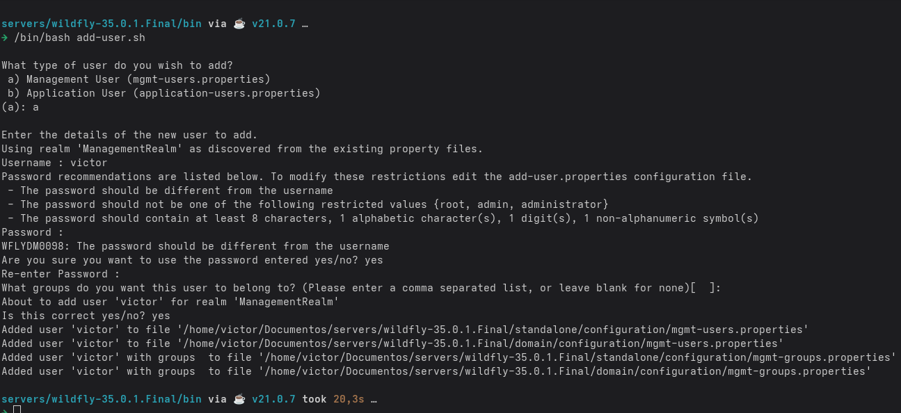
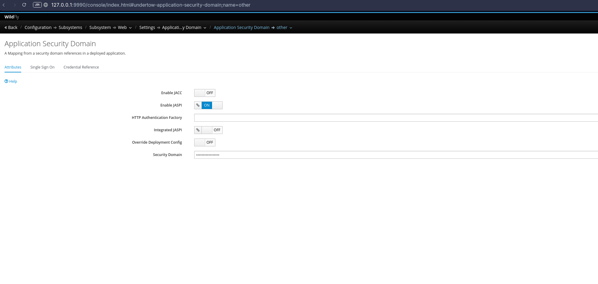

# 📚 Livraria Digital - eBooks of Code


---

## ✨ Sobre o Projeto

Este projeto é uma simulação de uma livraria digital especializada em **eBooks para programação**, construída com as tecnologias mais modernas do ecossistema Java.

A aplicação é dividida em duas áreas principais:

- **🏬 Vitrine Pública:** onde os usuários podem visualizar os eBooks disponíveis.
- **🛠 Back Office (Administração):** onde administradores podem gerenciar:
    - Autores
    - Livros
    - Categorias
    - Vendas
    - Usuários
    - Relatorios

## 🔧 Tecnologias Utilizadas

- **Java 21**
- **Jakarta EE 10**
- **Jakarta Faces (JSF) 4.1**
- **OmniFaces**
- **JPA**
- **PostgreSQL**
- **Wildfly 35**
- **Amazon S3 (via LocalStack)**
- **Maven**
- **Docker Compose**

## 🐳 Ambiente de Desenvolvimento

Para facilitar a execução local, utilizamos o `docker-compose` para subir os seguintes serviços:

- **PostgreSQL** (Banco de dados)
- **LocalStack** (Simulação do AWS S3)

### ▶️ Como executar

1. **Clone o repositório**
   ```bash
   git clone https://github.com/VictorHSP/jsf-ebookofcode.git
   cd jsf-ebookofcode
   ```
2. **Suba os serviços com Docker Compose**
   ```bash
   cd docker/
   docker-compose up -d
   ```

3. **Crie o Bucket S3 no LocalStack**
   ```bash
   cd localstack/
   /bin/bash init.sh
   ```

4. **Configure WildFly local em uma pasta de servidores**
   ```bash
   mkdir wildfly_35/
   cd wildfly_35/
   
   echo Downloading wildfly 35.0.1.Final...
   wget -q -O wildfly-35.0.1.Final.tar.gz https://github.com/wildfly/wildfly/releases/download/35.0.1.Final/wildfly-35.0.1.Final.tar.gz
   
   echo unziping...
   tar xf wildfly-35.0.1.Final.tar.gz
   
   echo removing tar.gz...
   rm wildfly-35.0.1.Final.tar.gz
   
   echo Getting standalone.xml...
   git clone git@github.com:VictorHSP/jsf-ebookofcode.git
   cd jsf-ebookofcode/
   cd ..
   cp -r jsf-ebookofcode/standalone/standalone.xml wildfly-35.0.1.Final/standalone/configuration
   rm -rf jsf-ebookofcode/
   
   echo adding postgresql module...
   cd wildfly-35.0.1.Final/modules/system/layers/base/
   mkdir -p org/postgresql/main
   touch org/postgresql/main/module.xml
   echo '<?xml version="1.0" ?><module xmlns="urn:jboss:module:1.9" name="org.postgresql"><resources><resource-root path="postgresql-42.7.5.jar"/></resources><dependencies><module name="javax.api"/><module name="javax.transaction.api"/></dependencies></module>' >> org/postgresql/main/module.xml
   wget -q -O org/postgresql/main/postgresql-42.7.5.jar https://jdbc.postgresql.org/download/postgresql-42.7.5.jar
   echo Finished!!
   ```

5. **Desabilitando JASPI Security Domain**

    1. Necessario para funcionar o `@CustomFormAuthenticationMechanismDefinition`. Desta forma
    a aplicacao reconhece as roles definidas `ADMIN` e `CUSTOMER` e conclui com sucesso a autenticacao e autorizacao.
   
    2. Criando um novo usuario admin no WildFly:
    ```bash
    cd wildfly-35.0.1.Final/bin
    /bin/bash add-user.sh
    ```
        

    3. Depois de criar o usuario, necessario inciar o servidor e entrar na url `http://localhost:9990/console/index.html`.
    ```bash
    cd wildfly-35.0.1.Final/bin
    /bin/bash standalone.sh
    ```
   Logue com seu username e password configurados no passo anterior. Va em `configuration -> Subsystems -> Web -> Application Security Domain -> Other (View)` Clique em `Edit`.
   
   4. Desabilite a opcao `Integrated JASPI`
    
    

## 📁 Estrutura de Pastas
```
jsf-ebookofcode/
│
├── src/
│   ├── main/
│   │   ├── java/         # Código fonte (JPA, Beans, Serviços)
│   │   ├── resources/    # Arquivos de configuração
│   │   └── webapp/       # Páginas JSF
│
├── docker/
│   ├── docker-compose.yml # Docker comose com os servicos do PostgreSQL e LocalStack
├── localstack/
│   ├── init.sh            # Criar do bucker S3 local
├── standalone/
│   ├── standalone.xml     # Standalone configurado com o datasource apontando para banco local
│
├── pom.xml
└── README.md
```
## ☁️ Integração com S3
A simulação de uploads e downloads de arquivos (como capas dos livros ou PDFs) 
é feita via **LocalStack**, que emula a AWS S3 localmente.

<hr>

Desenvolvido com 💻 por @victorhsp
